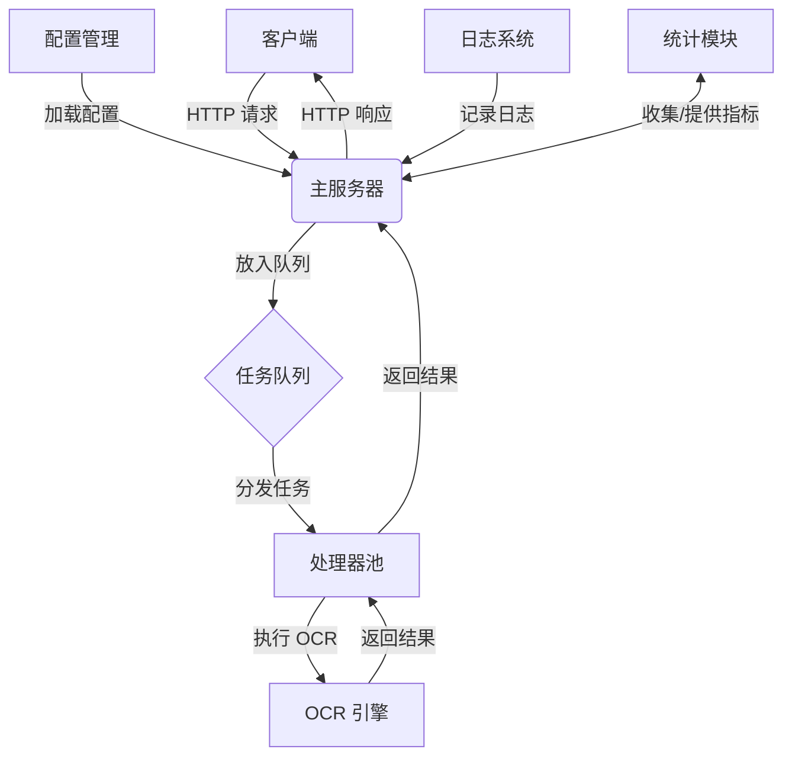

# OCR 服务器

## 目录
1. [项目概述](#项目概述)
2. [特性](#特性)
3. [安装](#安装)
4. [使用方法](#使用方法)
5. [配置选项](#配置选项)
6. [架构设计](#架构设计)
7. [性能优化](#性能优化)
8. [贡献指南](#贡献指南)
9. [故障排除](#故障排除)
10. [致谢](#致谢)
11. [许可证](#许可证)

## 项目概述

OCR 服务器是一个高性能、可扩展的光学字符识别（OCR）服务，基于 Go 语言构建。它利用 PaddleOCR 引擎提供快速、准确的文本识别功能。这个服务器设计用于处理大量并发的 OCR 请求，适用于需要高吞吐量 OCR 处理的应用场景。

## 特性

- **高性能**：利用处理器池来处理多个并发请求。
- **可扩展性**：根据需求动态调整 OCR 处理器数量。
- **容错能力**：实现了健康检查和自动处理器重初始化，确保系统稳定性。
- **灵活输入**：支持图片文件路径和 base64 编码的图片数据。
- **可配置**：通过 YAML 文件和命令行参数支持灵活配置。
- **日志记录**：详细的日志记录，支持日志轮转和压缩。
- **统计信息**：提供实时服务器统计信息以便监控。
- **自动下载**：如果需要，自动下载所需的 OCR 引擎。

## 安装

1. 克隆仓库：
```
git clone https://github.com/suifei/ocr-server.git
```
2. 进入项目目录：
```
cd ocr-server
```
3. 安装依赖：
```
go mod tidy
```
4. 构建项目 `cgo` (Windows+WSL/mingw64-gcc)：
```
go build -o ocr-server.exe cmd/server/main.go
```

## 使用方法

### 启动服务器

使用默认配置启动服务器：

```
./ocr-server.exe
```

服务器首次运行时会自动下载所需的 PaddleOCR 模型。


### Windows 下的命令行启动参数演示

以下是几种不同配置下在 Windows 上启动服务的命令行示例：

#### 使用默认配置启动服务

```sh
ocr-server.exe
```

#### 使用指定的配置文件启动服务

```sh
ocr-server.exe -config C:\path\to\config.yaml
```

#### 使用命令行参数覆盖配置文件中的设置

```sh
ocr-server.exe -config C:\path\to\config.yaml -addr 192.168.1.100 -port 8080 -min-processors 8 -log-file C:\logs\ocr_server.log
```

#### 仅使用命令行参数启动服务

```sh
ocr-server.exe -addr 192.168.1.100 -port 8080 -ocr C:\path\to\ocr_executable -min-processors 8 -max-processors 16 -queue-size 200 -scale-threshold 100 -degrade-threshold 50 -idle-timeout 10m -warm-up-count 4 -shutdown-timeout 1m -log-file C:\logs\ocr_server.log -log-max-size 200 -log-max-backups 5 -log-max-age 30 -log-compress
```

#### 显示帮助信息

```sh
ocr-server.exe -help
```

### 将服务启动为 Windows 服务

可以使用 `sc` 命令将服务注册为 Windows 服务：

#### 注册服务

```sh
sc create OCRServer binPath= "C:\path\to\ocr-server.exe -config C:\path\to\config.yaml" start= auto
```

#### 启动服务

```sh
sc start OCRServer
```

#### 停止服务

```sh
sc stop OCRServer
```

#### 删除服务

```sh
sc delete OCRServer
```

### 配置

可以通过 YAML 文件或命令行参数配置服务器。使用配置文件：

```
./ocr-server.exe -config path/to/config.yaml
```

使用命令行配置：

```
./ocr-server.exe -addr 192.168.1.100 -port 8080 -min-processors 8 -max-processors 16
```

### API 使用

对图片进行 OCR 处理：

```http
POST /
Content-Type: application/json

{
  "image_path": "/path/to/image.jpg"
}
```

或使用 base64 编码的图片：

```http
POST /
Content-Type: application/json

{
  "image_base64": "base64_encoded_image_data"
}
```

### 服务器统计

获取服务器统计信息：

```http
GET /stats
```

## 配置选项

| 选项 | 描述 | 默认值 |
|------|------|--------|
| addr | 服务器地址 | localhost |
| port | 服务器端口 | 1111 |
| ocr_exe_path | OCR 可执行文件路径 | 自动检测 |
| min_processors | 最小处理器数量 | 4 |
| max_processors | 最大处理器数量 | CPU 核心数 |
| queue_size | 任务队列大小 | 100 |
| scale_threshold | 扩展处理器阈值 | 75 |
| degrade_threshold | 缩减处理器阈值 | 25 |
| idle_timeout | 处理器空闲超时时间 | 5分钟 |
| warm_up_count | 预热处理器数量 | 2 |
| shutdown_timeout | 优雅关闭超时时间 | 30秒 |
| log_file_path | 日志文件路径 | ocr_server.log |
| log_max_size | 日志文件最大大小（MB） | 100 |
| log_max_backups | 保留的旧日志文件最大数量 | 3 |
| log_max_age | 保留旧日志文件的最大天数 | 28 |
| log_compress | 是否压缩轮转的日志文件 | true |

## 架构设计

OCR 服务器采用了模块化的设计，主要包含以下组件：

1. **主服务器（Server）**：负责 HTTP 请求的处理、任务分发和整体协调。
2. **处理器池（Processor Pool）**：管理多个 OCR 处理器，进行动态扩缩容。
3. **任务队列（Task Queue）**：缓冲传入的 OCR 请求，确保平稳处理。
4. **OCR 引擎（OCR Engine）**：封装 PaddleOCR，执行实际的 OCR 操作。
5. **配置管理（Config）**：处理服务器配置的加载和验证。
6. **日志系统（Logger）**：提供详细的日志记录功能。
7. **统计模块（Stats）**：收集和提供服务器性能指标。

### 流程图



### 关键组件说明

1. **主服务器（Server）**
   - 负责 HTTP 服务器的启动和关闭
   - 管理处理器池和任务队列
   - 处理入站请求并返回结果
   - 协调其他组件的工作

2. **处理器池（Processor Pool）**
   - 维护一组 OCR 处理器
   - 根据负载动态调整处理器数量
   - 实现处理器的健康检查和自动恢复

3. **任务队列（Task Queue）**
   - 使用 channel 实现的 FIFO 队列
   - 缓冲入站请求，防止系统过载
   - 允许异步处理请求

4. **OCR 引擎（OCR Engine）**
   - 封装 PaddleOCR 库
   - 提供图像到文本的转换功能
   - 处理不同格式的输入（文件路径或 base64）

5. **配置管理（Config）**
   - 从 YAML 文件、环境变量和命令行参数加载配置
   - 验证配置的正确性
   - 提供默认值和合理的约束

6. **日志系统（Logger）**
   - 使用分级日志（INFO、WARNING、ERROR）
   - 支持日志轮转和压缩
   - 同时输出到控制台和文件

7. **统计模块（Stats）**
   - 收集关键性能指标（请求数、处理时间等）
   - 提供 /stats 端点以供监控

### 请求处理流程

1. 客户端发送 HTTP POST 请求到服务器
2. 主服务器接收请求并创建 OCR 任务
3. 任务被放入任务队列
4. 处理器池中的可用处理器从队列中获取任务
5. 处理器调用 OCR 引擎执行文本识别
6. OCR 结果返回给处理器，然后返回给主服务器
7. 主服务器将结果作为 HTTP 响应发送给客户端

### 扩展性和容错

- 处理器池根据队列长度和处理器使用率动态调整大小
- 定期进行健康检查，自动重启不健康的处理器
- 使用退避策略进行重试，增强系统的鲁棒性
- 优雅关闭机制确保正在处理的任务能够完成

## 性能优化

- 使用处理器池和任务队列实现高并发处理
- 动态扩缩容以适应不同的负载情况
- 实现预热机制，减少冷启动时间
- 使用 base64 输入选项减少文件 I/O 操作
- 详细的性能指标收集，便于进行性能调优

## 贡献指南

我们欢迎任何形式的贡献！如果您想为项目做出贡献，请遵循以下步骤：

1. Fork 项目仓库
2. 创建您的特性分支 (`git checkout -b feature/AmazingFeature`)
3. 提交您的修改 (`git commit -m 'Add some AmazingFeature'`)
4. 推送到分支 (`git push origin feature/AmazingFeature`)
5. 开启一个 Pull Request

请确保您的代码符合项目的代码风格，并且为新功能编写了适当的测试。

## 故障排除

如果您遇到问题，请检查以下几点：

1. 确保 PaddleOCR 模型已正确下载和安装
2. 检查日志文件中是否有错误信息
3. 验证配置文件的正确性
4. 确保有足够的系统资源（CPU、内存）

如果问题仍然存在，请在 GitHub 上开启一个 issue，并提供详细的问题描述和日志信息。

## 致谢

OCR 服务器项目的开发离不开众多优秀的开源项目和社区的支持。我们在此特别感谢以下项目和贡献者：

- [Go 语言](https://golang.org/)：感谢 Go 团队开发了这门高效、简洁的编程语言，为我们提供了强大的开发工具和丰富的标准库。

- [PaddleOCR](https://github.com/PaddlePaddle/PaddleOCR)：感谢百度开源的这个强大的 OCR 工具箱，为我们提供了高精度的文字识别能力。

- [PaddleOCR-json](https://github.com/hiroi-sora/PaddleOCR-json)：特别感谢 hiroi-sora 开发的这个项目，它为 PaddleOCR 提供了便捷的 JSON 接口，大大简化了我们的集成工作。

我们还要感谢以下 Go 语言库的作者和维护者：

- [viper](https://github.com/spf13/viper)：优秀的配置解决方案。
- [validator](https://github.com/go-playground/validator)：强大的数据验证库。
- [lumberjack](https://github.com/natefinch/lumberjack)：可靠的日志轮转工具。
- [backoff](https://github.com/cenkalti/backoff)：实用的重试库。
- [go-unarr](https://github.com/gen2brain/go-unarr)：方便的解压缩工具。

这些开源项目为我们的开发工作提供了宝贵的支持，使得 OCR 服务器的开发成为可能。我们深深感谢这些项目的贡献者们付出的努力和分享精神。

同时，我们也要感谢所有为这个项目提供反馈、建议和贡献的用户和开发者。你们的参与让这个项目不断进步和完善。

如果在使用过程中发现任何问题或有任何改进建议，欢迎在 GitHub 上提出 issue 或 pull request。让我们一起努力，使这个项目变得更好！

## 许可证

本项目采用 MIT 许可证 - 查看 [LICENSE](LICENSE) 文件了解详情。